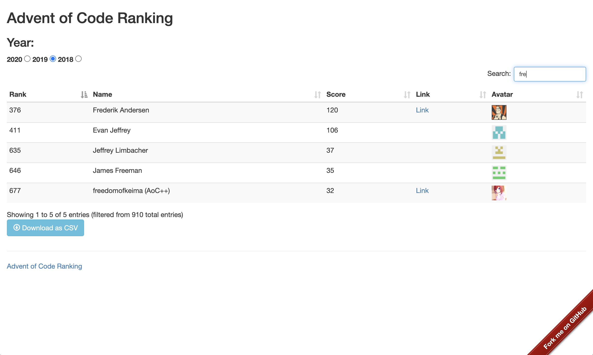

# Advent of Code Ranking

The goal is to show all non-zero score participants in one, global scoreboard.

Since AoC official scoreboard only shows Top 100 participants globally, it's hard to know your exact current rank compared to the others.

Available via Github Pages - [https://freedomofkeima.github.io/aoc-ranking/](https://freedomofkeima.github.io/aoc-ranking/)

## Requirements (Contributors)

- `brew install pre-commit` then install pre-commit scripts via `pre-commit install --install-hooks`

## License

This project is licensed under BSD 3-Clause.
